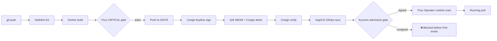

# 🔐 Supply Chain Security Lab

[](https://github.com/cbrkrtek/supply-chain-security-lab/actions/workflows/full-pipeline.yml)


## Overview

An end-to-end software supply chain security lab, built from a bare `git init` to a GitOps-deployed, admission-controlled Kubernetes workload. Every stage of the chain — source → build → scan → sign → SBOM → GitOps delivery → admission control → runtime monitoring — is independently verifiable, and no single control is trusted in isolation.

The core question this project answers: **if one layer of defense fails or is bypassed, what stops the attack at the next layer?**

## The Application

A deliberately minimal FastAPI service (`app/main.py`) — two endpoints, no business logic. The point of this project isn't the app; it's everything that happens to the app on its way to production:

```python
@app.get("/health")
def health():
    return {"status": "ok"}

@app.get("/")
def root():
    return {"service": "supply-chain-demo-app", "version": "0.1.0"}
```

## 🏗️ Architecture



**Design principle:** shift-left where possible (CI gates), enforce at admission where shift-left can be bypassed (Kyverno), and keep watching after deployment because static checks don't see runtime drift (Trivy Operator).

##  Tech Stack

| Layer | Tool | Purpose |
|---|---|---|
| Application | Python 3.11, FastAPI | Minimal service — the payload that travels through the chain |
| Container build | Docker (multi-stage), Hadolint | Hardened, linted image build |
| Vulnerability scanning | Trivy, Grype | CI gate + cross-validation between two independent scanners |
| Prioritization | Custom Python script + FIRST.org EPSS API | Risk triage by real-world exploitation probability, not just CVSS |
| SBOM | Syft (SPDX + CycloneDX) | Machine-readable bill of materials, attached and attested |
| Signing | Cosign / Sigstore (Fulcio, Rekor) | Keyless signing via GitHub Actions OIDC, public transparency log |
| CI/CD | GitHub Actions | Sequential security gate: lint → scan → sign → attest → verify |
| Registry | GitHub Container Registry (GHCR) | Image + signature + SBOM + attestation storage |
| GitOps | ArgoCD | Pull-based deployment, no cluster credentials in CI |
| Admission control | Kyverno | Policy-as-code — blocks unsigned images at the API server |
| Runtime security | Trivy Operator | Continuous in-cluster vulnerability & config drift scanning |
| Orchestration | kind (3-node) | Local multi-node Kubernetes cluster |

## 🎯 Key Achievements

- Built a fully automated, sequential CI/CD security gate (**Hadolint → Trivy → Cosign sign → SBOM → attest → verify**) — any failed step stops the pipeline; nothing is signed or shipped unless it passes every check.
- **Reduced CRITICAL findings from 3 → 0** in the production image by identifying that they lived in an unused `perl-base` package and removing it from the final image layer — a real fix, not a suppressed finding.
- Formally documented **2 CRITICAL/HIGH CVEs with EPSS scores up to 99.995%** as `not_affected` via an OpenVEX statement, with an explicit justification (unused init-system code path) rather than silent ignoring.
- Migrated from key-based Cosign signing to **fully keyless signing via GitHub Actions OIDC** (Fulcio + Rekor) — no long-lived private key in the CI pipeline.
- Enforced a Kyverno admission policy requiring valid Cosign signatures tied to a specific GitHub Actions OIDC identity (issuer + subject) — **100% of unsigned image deployments blocked**, including at the `Deployment` level via Kyverno's autogen rules, before any Pod or ReplicaSet was even created.
- Deployed Trivy Operator for continuous runtime scanning and cross-validated its automated findings against a manual Grype scan of the same image — confirmed parity.
- Built a custom vulnerability triage script that batch-queries the FIRST.org EPSS API and re-ranks findings by real-world exploitation likelihood instead of raw CVSS severity.
- Connected ArgoCD via pull-based GitOps and captured a live case where **`Sync: Failed` was the correct, visible outcome** — Kyverno blocked a deliberately unsigned image and ArgoCD surfaced the failure directly in its UI rather than silently reporting `Healthy`.

## 🔍 Findings

### Finding 1 — A container registry provides no integrity guarantee on its own
Pushed a second, unsigned image variant to GHCR. `docker pull` retrieved it without a single warning. `cosign verify` against the same tag rejected it outright (`Error: no signatures found`). The registry is a storage and distribution mechanism — it makes no claim about who built an image or whether it matches what was intended. Signing and verification are a separate, opt-in trust layer that has to be deliberately enforced downstream (which is exactly what the Kyverno policy does later in the chain).

### Finding 2 — CVSS severity and real-world exploitability are not the same question
Ran the same image through both Grype and Trivy from an identical SBOM and diffed the results — the two scanners disagreed on several CVEs due to differing vulnerability databases and update cadence. Built a triage script that re-sorts findings by EPSS (probability of exploitation in the next 30 days) instead of raw severity. The clearest example: `perl-base` in the base image carried CVEs with EPSS scores of **99.995%** and **81.7%**, both rated High severity — numbers that would suggest urgent action. Investigation showed the vulnerable code path was systemd's DNSSEC resolver, which is never active as PID 1 inside a container. Documented as `not_affected` in a VEX statement with justification `vulnerable_code_not_in_execute_path`, rather than either blindly blocking the build or blindly ignoring a 99.995% EPSS score.

*(Also learned mid-week that `cosign attach sbom` / `sign --attachment sbom` are deprecated in favor of native OCI attestations — adjusted the pipeline to use `cosign attest` going forward.)*

### Finding 3 — Static scanning doesn't see what's actually running
Trivy Operator was deployed for continuous runtime scanning. Comparing its automated `VulnerabilityReport` for the application pod against a deliberately outdated `nginx:1.27-alpine` deployment confirmed the operator finds real, distinct vulnerability counts per workload without any manual re-scan. Separately, manually patching a running deployment to `runAsNonRoot: false` / `runAsUser: 0` — a change that never touched git — was picked up by Trivy Operator's `ConfigAuditReport` on its next reconciliation cycle. **The manifest in git stayed hardened the entire time; only the live cluster state drifted.** This is the direct argument for runtime scanning on top of CI-time scanning: a clean git history doesn't guarantee a clean running cluster.

### Finding 4 — Admission control can stop an attack a layer earlier than expected
Simulated a compromised deployment: built and pushed an intentionally **unsigned** image (`:test`), pointed the ArgoCD-managed manifest at it, and pushed to `main`. ArgoCD's sync did **not** report a false `Healthy` — it reported `Sync: Failed` directly, with the underlying cause visible in the UI:

```
admission webhook "mutate.kyverno.svc-fail" denied the request:
resource Deployment/supply-chain-security-lab/security-lab was blocked due to the following policies
require-signed-images:
  autogen-verify-cosign-keyless-signature: 'failed to verify image ...:test: no signatures found'
```

The interesting detail: the rule that fired was `autogen-verify-cosign-keyless-signature` — Kyverno automatically generated a `Deployment`-level copy of the Pod-matching policy and blocked the **Deployment object itself**, before a ReplicaSet or Pod was ever created. GitOps pull-based delivery, admission-time signature verification, and Sigstore's transparency log all reinforced each other here: no unsigned workload got anywhere near running, and the failure was visible rather than hidden behind a green checkmark.

##  EPSS-Based Triage Script

`app/triage.py` — reads a Grype JSON report, batch-queries the FIRST.org EPSS API (up to 100 CVEs per request instead of one call per CVE), and re-ranks findings by real-world exploitation probability instead of raw severity:

```python
import os
import json
import requests

BASE_DIR = os.path.dirname(os.path.dirname(os.path.abspath(__file__)))
REPORT_PATH = os.path.join(BASE_DIR, "docs", "scanners-reports", "grype-report.json")

with open(REPORT_PATH) as f:
    report = json.load(f)

matches = report.get("matches", [])
cve_ids = list({m["vulnerability"]["id"] for m in matches if m["vulnerability"]["id"].startswith("CVE-")})

epss_map = {}
for i in range(0, len(cve_ids), 100):
    batch = cve_ids[i:i+100]
    r = requests.get(f"https://api.first.org/data/v1/epss?cve={','.join(batch)}")
    for entry in r.json().get("data", []):
        epss_map[entry["cve"]] = float(entry["epss"])

findings = []
for m in matches:
    cve = m["vulnerability"]["id"]
    sev = m["vulnerability"]["severity"]
    epss = epss_map.get(cve, 0.0)
    findings.append((cve, sev, epss))

findings.sort(key=lambda x: x[2], reverse=True)
for cve, sev, epss in findings[:5]:
    print(f"{cve} | severity={sev} | epss={epss}")
```

This is what surfaced the `perl-base` CVEs with 99.995% and 81.7% EPSS scores discussed in Finding 2 — a naive "block on High severity" rule would have missed the real signal (or blocked the build for the wrong reason) without this re-ranking.

## 📸 Evidence

*(place under `docs/screenshots/`)*

| Day | File | Shows |
|---|---|---|
| Mon |  | `docker pull` succeeds silently on an unsigned image |
| Mon |  | `cosign verify` rejects the same unsigned image |
| Tue |  | Key-based SBOM signing (and the deprecation warning that prompted the move to attestations) |
| Tue |  | SBOM attached as an OCI artifact in GHCR |
| Wed |  | Automated `VulnerabilityReport` comparison: hardened app vs. deliberately outdated nginx |
| Wed | | Cluster-wide `ConfigAuditReport` coverage across all namespaces |
| Wed | .PNG) | Manual drift injection (`runAsNonRoot: false`, `runAsUser: 0`) |
| Wed | | Trivy Operator detecting the drift |
| Wed |  | `VulnerabilityReport` CRDs across the cluster |
| Thu | | GHCR package page showing signed (`.sig`) + attested (`.att`) + SBOM (`.sbom`) artifacts |
| Thu | | ArgoCD Application synced against the repo |
| Thu |  | **The mismatch experiment** — ArgoCD `Sync: Failed`, Kyverno denial message in full |

## 🚀 Quickstart

### Build and run locally
```bash
git clone https://github.com/cbrkrtek/supply-chain-security-lab.git
cd supply-chain-security-lab
docker build -t supply-chain-demo-app .
docker run --rm -d -p 8081:8080 supply-chain-demo-app
curl http://localhost:8081/health
```

### Trigger the full CI/CD pipeline
```bash
git push origin main
# watch it run under the Actions tab:
# Hadolint → Build → Trivy scan → Push → Cosign sign (keyless) →
# Syft SBOM → Cosign attach/attest → Cosign verify
```

### Run the Day 1 keyless-signing experiment manually
```bash
# .github/workflows/build-sign.yml — workflow_dispatch only, isolated proof-of-concept
# for OIDC keyless signing before it was folded into the full pipeline
gh workflow run build-sign.yml
```

### Deploy to a local kind cluster with admission control
```bash
kind create cluster --config k8s-manifests/kind-config.yaml --name supply-chain-lab

helm repo add kyverno https://kyverno.github.io/kyverno/
helm install kyverno kyverno/kyverno -n kyverno --create-namespace
kubectl apply -f kyverno-policies/require-signed-images.yaml

helm repo add aqua https://aquasecurity.github.io/helm-charts/
helm install trivy-operator aqua/trivy-operator -n trivy-system --create-namespace

kubectl apply -f argocd/application.yaml
```

## 📁 Repository Structure

```
supply-chain-security-lab/
├── app/
│   ├── main.py               # FastAPI service — /health and / endpoints
│   ├── requirements.txt      # fastapi==0.111.0, uvicorn==0.30.0
│   └── triage.py             # EPSS-based vulnerability triage (batched FIRST.org queries)
├── Dockerfile                # Multi-stage, hardened, non-root, minimized base image
├── k8s-manifests/            # Deployment + kind cluster config
├── kyverno-policies/         # Admission control policies
├── argocd/                   # ArgoCD Application definitions
├── docs/
│   ├── sbom-spdx.json
│   ├── sbom-cyclonedx.json
│   ├── scanners-reports/     # grype-report.json, trivy-report.txt
│   ├── vex.json
│   └── screenshots/
└── .github/workflows/
    ├── build-sign.yml        # Day 1: manual (workflow_dispatch) keyless-signing experiment
    └── full-pipeline.yml     # Full automated gate — triggers on every push to main
```

**Pipeline evolution:** `build-sign.yml` started as a manually-triggered experiment on Day 1 to validate keyless signing via GitHub Actions OIDC in isolation — note it pushes to a different image name (`supply-chain-demo-app`, using a personal access token) than the final pipeline. Once the OIDC pattern was confirmed working, it was redesigned and folded into `full-pipeline.yml` — the complete, automatic, push-triggered gate (Hadolint → Trivy → sign → SBOM → attest → verify) under the repository's own name (`supply-chain-security-lab`), authenticated with the default scoped `GITHUB_TOKEN` instead of a long-lived PAT. The badge at the top of this README tracks `full-pipeline.yml`; `build-sign.yml` is kept as a record of the initial proof-of-concept.

## ⚖️ License

MIT
